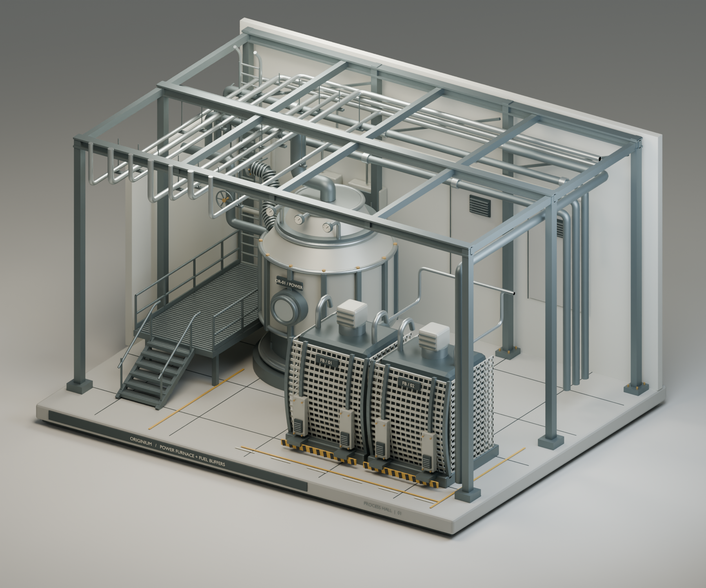
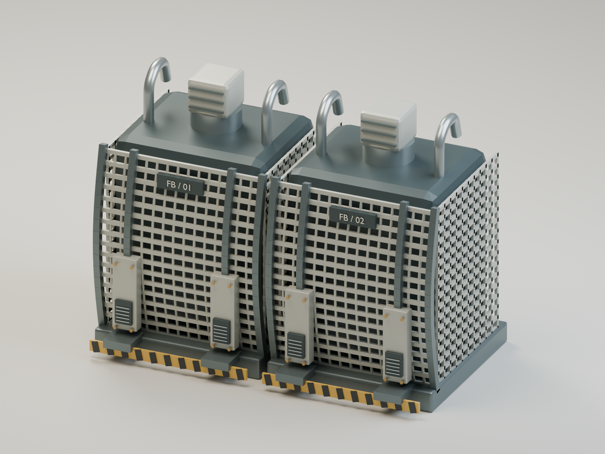

# 源石工业设施 · Blender 场景

根据提供的参考图，通过 BlenderMCP 制作的工业设施模型。适用于等距视角的基地建设、工厂经营，以及科幻动力室场景。

## 场景内容

- 中央动力炉与两个格栅燃料缓冲仓。
- 架空管网、阀门、仪表及软管。
- 剖面厂房钢架、检修平台、楼梯与爬梯。
- 六个命名集合，保留可编辑部件、材质、灯光及两台相机。
- 工程内嵌参考图与建模脚本。

## 文件

| 文件 | 用途 |
| --- | --- |
| [originium_facility.blend](originium_facility.blend) | Blender 工程 |
| [overview.png](overview.png) | 1800 × 1500 场景总览 |
| [fuel_buffers_detail.png](fuel_buffers_detail.png) | 1600 × 1200 燃料仓细节 |

使用 Blender 5.2.1 LTS 制作。打开工程后，当前场景为 ORIGINIUM - Industrial cutaway；CAM 01 为总览相机，CAM 02 为燃料仓细节相机。

模型按参考图视觉比例制作，尺寸为估算，并非工程施工图。参考图及相关游戏设定的权利属于原权利人。本仓库未另行授予使用许可。

## 燃料仓细节

